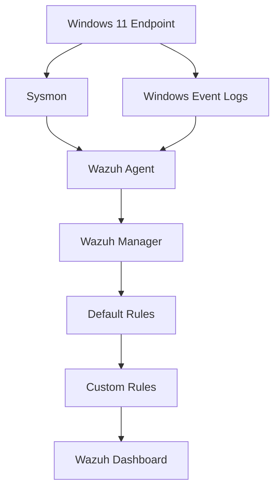

<div align="center">

# Windows Detection Engineering with Wazuh & Atomic Red Team

**Attacker simulation → endpoint telemetry → default detection → false-positive analysis → custom Wazuh rules**


</div>

A home-lab project covering the full path from attacker simulation to a tuned detection: running an Atomic Red Team technique against a Windows host, tracing it through endpoint telemetry, evaluating Wazuh's default detection, and writing custom rules to reduce false positives and improve alert fidelity.

<br>

## Contents

- [Scope](#scope)
- [Lab Setup](#lab-setup)
- [Installation & Configuration](#installation--configuration)
- [The Technique](#the-technique)
- [Walkthrough](#walkthrough)
- [Custom Rules](#custom-rules)
- [Limitations](#limitations)
- [Repo Layout](#repo-layout)
- [Next Steps](#next-steps)

<br>

## Scope

The goal was to practice detection engineering, taking a default rule match and improving it based on an actual false-positive analysis, rather than treating an alert firing as the end state.

| # | Task |
|---|---|
| 1 | Run one Atomic Red Team technique against a Windows 11 host |
| 2 | Trace that activity through Sysmon and Windows Event Viewer, before ever looking at Wazuh |
| 3 | Confirm how Wazuh's default rule set handles it |
| 4 | Find the false positive that came from the test harness itself, not the technique |
| 5 | Write a Wazuh rule to suppress that false positive without weakening detection |
| 6 | Write a second rule that reliably catches the actual technique regardless of how it's invoked |
| 7 | Document the before / after |

The scope is deliberately one technique, covered end to end, rather than multiple techniques covered superficially.

<br>

## Lab Setup

| Component | Role |
|---|---|
| Windows 11 (VM) | Target endpoint, where the atomic test runs |
| Sysmon | Process-level telemetry on the endpoint |
| Wazuh Agent | Ships Windows / Sysmon logs off the host |
| Wazuh Manager | Correlates logs, applies rules, generates alerts |
| Wazuh Dashboard | Where alerts were reviewed |
| Atomic Red Team | Generates the attacker behavior in a controlled, repeatable way |



> No production data, no real credentials in this repo. Network details are scrubbed where they don't matter to the write-up.

<br>

## Installation & Configuration

This section documents how the lab was actually built, so it can be reproduced.

### VMware Networking

Both the Windows 11 endpoint and the Wazuh server VM are set to **Bridged** networking, not NAT.

| Mode | Why not |
|---|---|
| NAT | Each VM gets an address behind VMware's own virtual router. The agent can't reach the manager on its actual LAN IP without extra port-forwarding rules, and the server can't be reached from anything outside the host. |
| Host-only | Isolates the VMs to a private virtual switch — the endpoint and server would talk to each other fine, but this adds a layer that isn't necessary for a two-VM lab. |
| **Bridged** | Both VMs get their own address on the physical LAN, exactly as if they were separate machines on the network. The agent connects to the manager's real IP with no extra routing to configure. |

Set per-VM in VMware: **VM → Settings → Network Adapter → Bridged**. Confirm both VMs can reach each other (`ping <manager-ip>` from the Windows host) before installing the agent.

### Wazuh Manager (Ubuntu Server)

Installed using the official all-in-one install script, which sets up the Wazuh manager, indexer, and dashboard on a single node — sufficient for a lab of this size.

```bash
curl -sO https://packages.wazuh.com/4.x/wazuh-install.sh
sudo bash wazuh-install.sh -a
```

The script prints the dashboard admin credentials at the end of the run — save those before they scroll off. Confirm the manager is running:

```bash
sudo systemctl status wazuh-manager
```

Dashboard is reachable at `https://<server-ip>` once the install finishes.

### Wazuh Agent (Windows 11)

Downloaded and installed the MSI package, pointed at the manager's bridged IP at install time:

```powershell
Invoke-WebRequest -Uri https://packages.wazuh.com/4.x/windows/wazuh-agent-4.x.x-1.msi -OutFile $env:TEMP\wazuh-agent.msi

msiexec.exe /i $env:TEMP\wazuh-agent.msi /q WAZUH_MANAGER='<manager-ip>' WAZUH_AGENT_NAME='win11-agent'
```

Start the service and confirm it's running:

```powershell
NET START WazuhSvc
Get-Service WazuhSvc
```

The agent should show up as **Active** under **Agents** in the Wazuh dashboard within a minute or two. If it doesn't, it's almost always the bridged network / firewall, not the install.

### Sysmon

Installed separately from Wazuh, using a standard SwiftOnSecurity-style config for a reasonable balance of coverage vs. log volume:

```powershell
Sysmon64.exe -accepteula -i sysmonconfig.xml
```

### Editing `ossec.conf` — Agent Side

Location on the Windows endpoint:

```
C:\Program Files (x86)\ossec-agent\ossec.conf
```

This is where the agent is told *what to forward*. By default it ships basic Windows log collection, but Sysmon isn't included automatically — it has to be added as a `<localfile>` block:

```xml
<localfile>
  <location>Microsoft-Windows-Sysmon/Operational</location>
  <log_format>eventchannel</log_format>
</localfile>
```

Also confirmed PowerShell Operational logging was present:

```xml
<localfile>
  <location>Microsoft-Windows-PowerShell/Operational</location>
  <log_format>eventchannel</log_format>
</localfile>
```

After editing, the agent service has to be restarted for it to take effect:

```powershell
Restart-Service WazuhSvc
```

### Editing `local_rules.xml` — Manager Side

Custom rules don't go in the main `ossec.conf` — they live in their own file so they survive Wazuh updates:

```
/var/ossec/etc/rules/local_rules.xml
```

Both rule `100201` (false-positive suppression) and rule `100210` (encoded PowerShell detection) were added here. Custom rule IDs have to stay in the `100000–119999` range, which is reserved for local/custom rules and won't collide with Wazuh's built-in rule set.

Before restarting anything, the rule syntax was validated using Wazuh's built-in log tester so a typo doesn't silently break the manager:

```bash
sudo /var/ossec/bin/wazuh-logtest
```

Once the rule logic checked out, the manager was restarted to load it:

```bash
sudo systemctl restart wazuh-manager
```

Manager-side config (log sources, integrations, global settings — as opposed to detection logic) lives separately at:

```
/var/ossec/etc/ossec.conf
```

That file wasn't touched for this project — everything needed lived in `local_rules.xml` plus the agent's `ossec.conf`.

<br>

## The Technique

| | |
|---|---|
| **MITRE ATT&CK** | `T1059.001` — Command and Scripting Interpreter: PowerShell |
| **Atomic Test** | `T1059.001-15` — PowerShell executed via `-EncodedCommand` |

This technique was chosen because it's simple enough to reason about end-to-end but still reflects behavior real attackers use routinely — Base64-encoded PowerShell to dodge basic string matching and logging. The "bad" signal (an encoded command) and the "noise" (test-harness artifacts) are easy to tell apart once the telemetry is actually inspected instead of trusting the alert name at face value.

<br>

## Walkthrough

**1. Ran the atomic test on the Windows host**
`powershell.exe` was executed with `-EncodedCommand`, using a Base64/UTF-16LE encoded payload — the standard encoding PowerShell expects for that flag. Test harness reported success.

**2. Checked the raw telemetry before touching Wazuh**
Sysmon logged the process creation (parent process, command line, PID, GUID). Windows PowerShell Operational and Security logs backed that up. This step confirms the activity was visible at the source, so if Wazuh missed something later it would be clear whether the gap was a collection problem or a rule problem.

**3. Checked Wazuh's default detection**
Wazuh's built-in rule set (e.g. rule `92027` — PowerShell spawning PowerShell) picked up related activity, confirming ingestion and baseline correlation were working. The alerts were generic, though, and one of them flagged something unrelated to the actual technique.

**4. Found the false positive**
The atomic test's own harness leaves behind an artifact (`PScriptPolicyTest`) as part of how it runs — unrelated to the technique itself. A default rule matched on it and generated an unrelated alert. Left unaddressed, that kind of noise reduces the signal-to-noise ratio of the alert queue, so it was treated as something to fix rather than ignore.

**5. Wrote two custom rules** — see [Custom Rules](#custom-rules) below.

**6. Compared before and after**

| | Before | After |
|---|---|---|
| Detection | Correct but generic | Specific to encoded PowerShell execution |
| Noise | Benign test artifact triggers an alert | Artifact suppressed |
| Parent process dependency | Implicit | None — fires regardless of parent |

<br>

## Custom Rules

<table>
<tr><td width="120"><b>Rule 100201</b></td><td>False positive suppression</td></tr>
<tr><td colspan="2">Matches the <code>PScriptPolicyTest</code> artifact generated by the Atomic Red Team harness and drops it before it becomes alert noise. Scoped narrowly to that filename — does not touch any other PowerShell activity.</td></tr>
</table>

<table>
<tr><td width="120"><b>Rule 100210</b></td><td>Encoded PowerShell detection</td></tr>
<tr><td colspan="2">Fires when <code>powershell.exe</code> is executed with a common encoded-command flag (<code>-enc</code>, <code>-e</code>, <code>-ec</code>, <code>-EncodedCommand</code>). Independent of parent process. Severity level 10, mapped to <code>T1059.001</code>.</td></tr>
</table>


