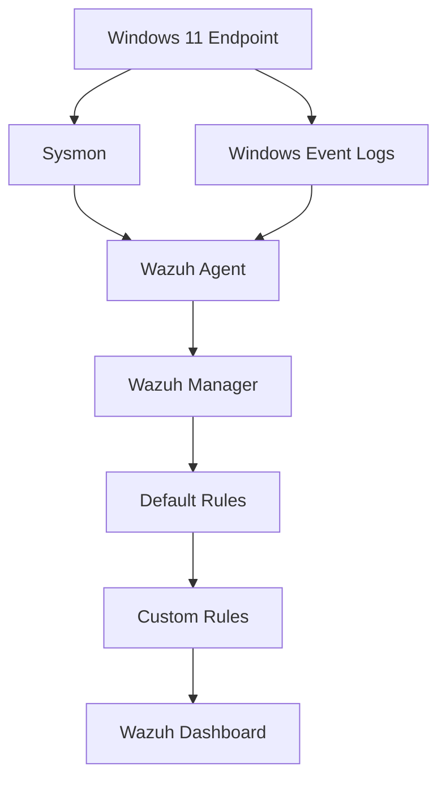

<div align="center">

# Windows Detection Engineering with Wazuh & Atomic Red Team

**Attacker simulation → endpoint telemetry → default detection → false-positive analysis → custom Wazuh rules**


</div>

A home-lab project covering the full path from attacker simulation to a tuned detection: running an Atomic Red Team technique against a Windows host, tracing it through endpoint telemetry, evaluating Wazuh's default detection, and writing custom rules to reduce false positives and improve alert fidelity.

<br>

## Contents

- [Scope](#scope)
- [Lab Setup](#lab-setup)
- [The Technique](#the-technique)
- [Walkthrough](#walkthrough)
- [Custom Rules](#custom-rules)
- [Limitations](#limitations)
- [Repo Layout](#repo-layout)
- [Next Steps](#next-steps)

<br>

## Scope

The goal was to practice detection engineering, not just SIEM deployment — taking a default rule match and improving it based on an actual false-positive analysis, rather than treating an alert firing as the end state.

| # | Task |
|---|---|
| 1 | Run one Atomic Red Team technique against a Windows 11 host |
| 2 | Trace that activity through Sysmon and Windows Event Viewer, before ever looking at Wazuh |
| 3 | Confirm how Wazuh's default rule set handles it |
| 4 | Find the false positive that came from the test harness itself, not the technique |
| 5 | Write a Wazuh rule to suppress that false positive without weakening detection |
| 6 | Write a second rule that reliably catches the actual technique regardless of how it's invoked |
| 7 | Document the before / after |

The scope is deliberately one technique, covered end to end, rather than multiple techniques covered superficially.

<br>

## Lab Setup

| Component | Role |
|---|---|
| Windows 11 (VM) | Target endpoint, where the atomic test runs |
| Sysmon | Process-level telemetry on the endpoint |
| Wazuh Agent | Ships Windows / Sysmon logs off the host |
| Wazuh Manager | Correlates logs, applies rules, generates alerts |
| Wazuh Dashboard | Where alerts were reviewed |
| Atomic Red Team | Generates the attacker behavior in a controlled, repeatable way |



> No production data, no real credentials in this repo. Network details are scrubbed where they don't matter to the write-up.

<br>

## The Technique

| | |
|---|---|
| **MITRE ATT&CK** | `T1059.001` — Command and Scripting Interpreter: PowerShell |
| **Atomic Test** | `T1059.001-15` — PowerShell executed via `-EncodedCommand` |

This technique was chosen because it's simple enough to reason about end-to-end but still reflects behavior real attackers use routinely — Base64-encoded PowerShell to dodge basic string matching and logging. The "bad" signal (an encoded command) and the "noise" (test-harness artifacts) are easy to tell apart once the telemetry is actually inspected instead of trusting the alert name at face value.

<br>

## Walkthrough

**1. Ran the atomic test on the Windows host**
`powershell.exe` was executed with `-EncodedCommand`, using a Base64/UTF-16LE encoded payload — the standard encoding PowerShell expects for that flag. Test harness reported success.

**2. Checked the raw telemetry before touching Wazuh**
Sysmon logged the process creation (parent process, command line, PID, GUID). Windows PowerShell Operational and Security logs backed that up. This step confirms the activity was visible at the source, so if Wazuh missed something later it would be clear whether the gap was a collection problem or a rule problem.

**3. Checked Wazuh's default detection**
Wazuh's built-in rule set (e.g. rule `92027` — PowerShell spawning PowerShell) picked up related activity, confirming ingestion and baseline correlation were working. The alerts were generic, though, and one of them flagged something unrelated to the actual technique.

**4. Found the false positive**
The atomic test's own harness leaves behind an artifact (`PScriptPolicyTest`) as part of how it runs — unrelated to the technique itself. A default rule matched on it and generated an unrelated alert. Left unaddressed, that kind of noise reduces the signal-to-noise ratio of the alert queue, so it was treated as something to fix rather than ignore.

**5. Wrote two custom rules** — see [Custom Rules](#custom-rules) below.

**6. Compared before and after**

| | Before | After |
|---|---|---|
| Detection | Correct but generic | Specific to encoded PowerShell execution |
| Noise | Benign test artifact triggers an alert | Artifact suppressed |
| Parent process dependency | Implicit | None — fires regardless of parent |

<br>

## Custom Rules

<table>
<tr><td width="120"><b>Rule 100201</b></td><td>False positive suppression</td></tr>
<tr><td colspan="2">Matches the <code>PScriptPolicyTest</code> artifact generated by the Atomic Red Team harness and drops it before it becomes alert noise. Scoped narrowly to that filename — does not touch any other PowerShell activity.</td></tr>
</table>

<table>
<tr><td width="120"><b>Rule 100210</b></td><td>Encoded PowerShell detection</td></tr>
<tr><td colspan="2">Fires when <code>powershell.exe</code> is executed with a common encoded-command flag (<code>-enc</code>, <code>-e</code>, <code>-ec</code>, <code>-EncodedCommand</code>). Independent of parent process. Severity level 10, mapped to <code>T1059.001</code>.</td></tr>
</table>

Full XML and reasoning for both rules are in [`wazuh/rules/`](wazuh/rules/).

<br>

## Limitations

> [!NOTE]
> Being upfront about scope, because it matters.

- This is one technique, tested once, in an isolated lab — not a validated detection for production.
- "False positives suppressed" means *this specific known-benign artifact*, not false positives in general.
- The custom rules haven't been tested against obfuscation variants, different encodings, or evasion attempts. That's a next step, not something this project covers yet.

<br>

## Repo Layout

```
docs/            step-by-step write-up (setup → test → telemetry → detection → FP analysis → custom rules)
atomic-tests/    which atomic test was run and its output
wazuh/rules/     the custom rule XML and notes on why each rule looks the way it does
telemetry/       raw notes on what Sysmon / PowerShell / Security logs showed
screenshots/     evidence, organized in the order the project actually happened
findings/        the reasoning tying it all together
```

Screenshots are numbered by phase (`01-atomic-test`, `02-event-viewer`, `03-wazuh-default`, `04-false-positives`, `05-custom-rules`, `06-final-detection`) so the chain can be followed visually without reading anything else.

<br>

## Next Steps

- Run more `T1059` sub-techniques — encoded command is just one variant — and check whether rule `100210` still holds up
- Test against obfuscation tricks (character substitution, split strings) to find where the current rule breaks
- Move from one atomic test to a small batch across a couple of tactics, so the false-positive tuning has more than one data point behind it
- Determine whether the same `PScriptPolicyTest`-style suppression is needed for other Atomic Red Team tests, since it's a harness artifact rather than a one-off

---

<sub>Built as a personal lab project to get hands-on experience with detection engineering rather than basic SIEM deployment. Feedback and corrections are welcome.</sub>
